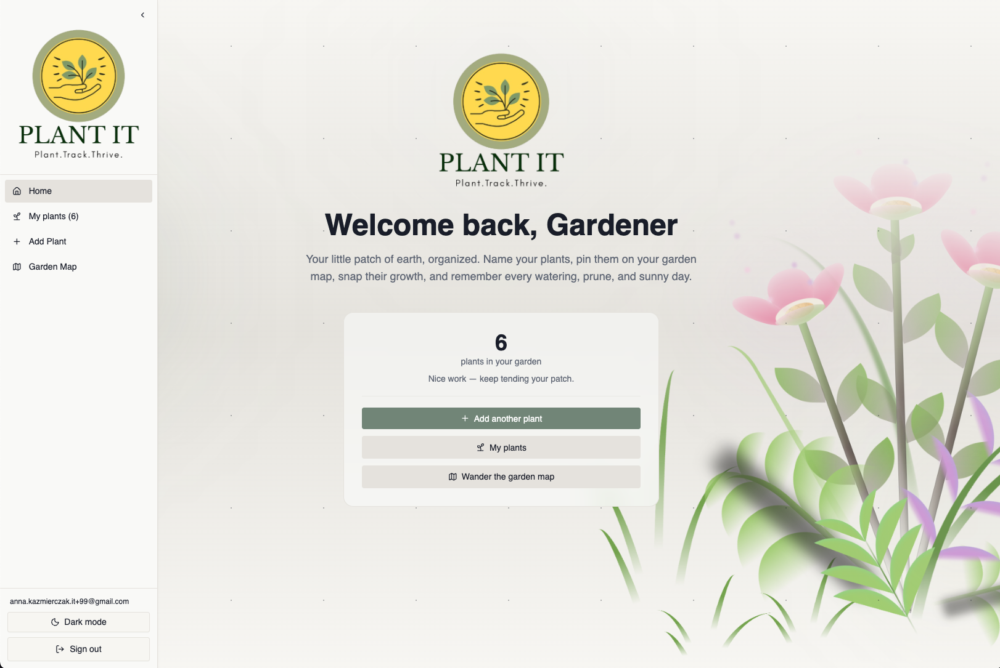
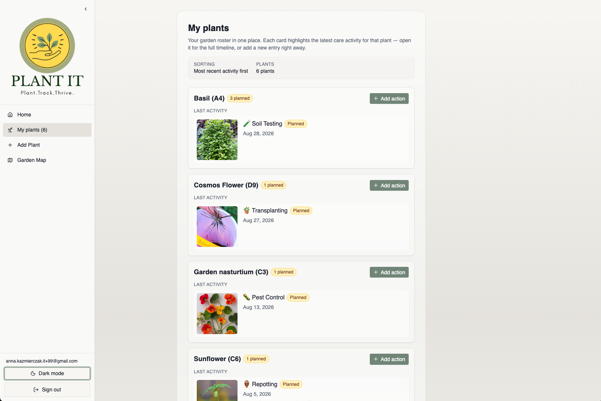
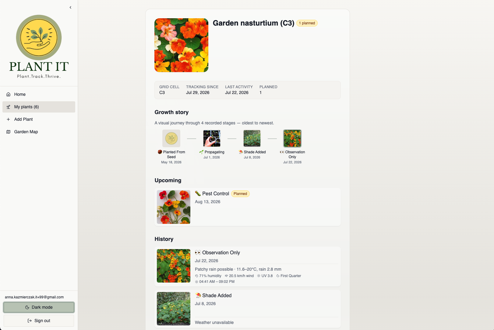
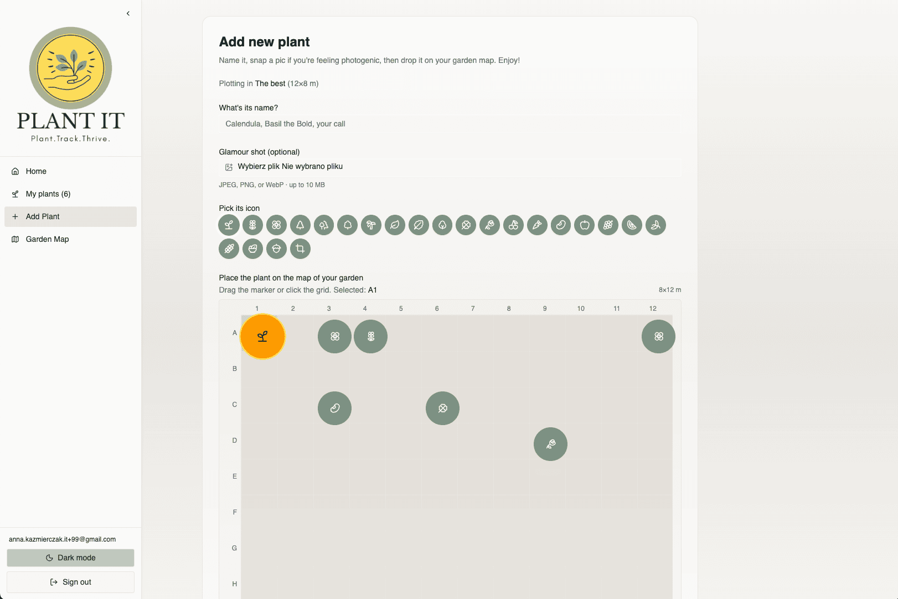
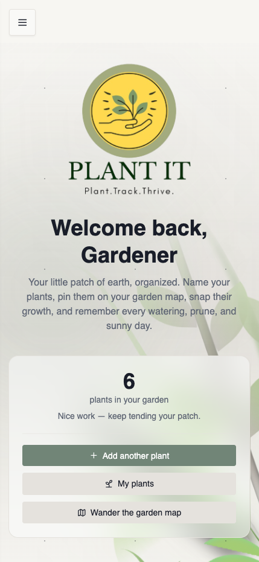
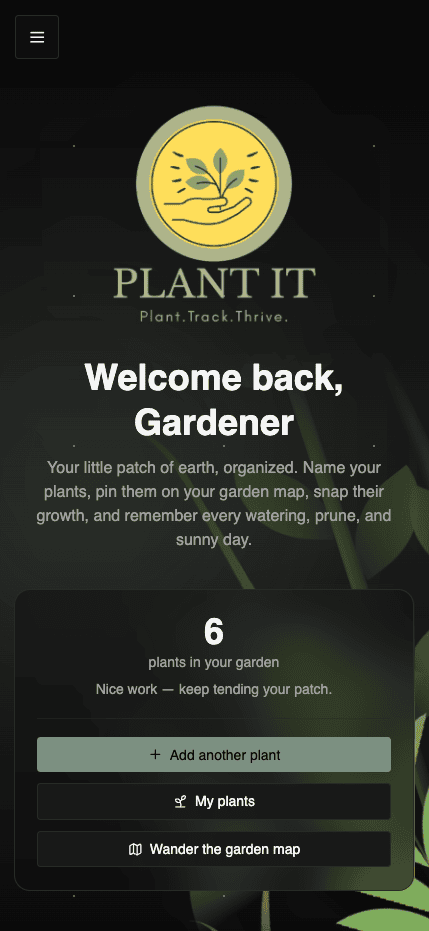
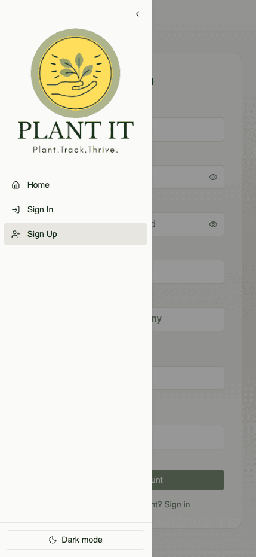
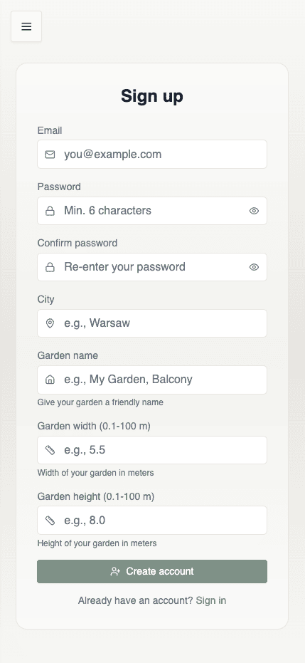

# Plant It 🌱

<picture>
  <source media="(prefers-color-scheme: dark)" srcset="./public/plant_it_logo_darkmode.png">
  <source media="(prefers-color-scheme: light)" srcset="./public/plant_it_logo.png">
  
</picture>

**A visual garden tracking app that helps hobby gardeners document plant growth with photos, weather data, and spatial organization.**

[](https://plant-it.anna-kazmierczak-it.workers.dev)
[](LICENSE)

> 🚀 **Live Demo:** **[https://plant-it.anna-kazmierczak-it.workers.dev](https://plant-it.anna-kazmierczak-it.workers.dev)**

---

## Overview

**Plant It** is a web application designed for hobby gardeners who want to track their plants' growth journey through photos and care actions. Instead of relying on memory or scattered camera roll photos, gardeners can document every stage of their plants' development — from seed to harvest — with photos, dates, and contextual information.

The app automatically enriches each care action with historical weather data (temperature, precipitation, sun/moon phase), helping you understand how environmental conditions affected your plants. A visual garden map lets you track which garden locations produce the best results.

**Who it's for:** Home gardeners managing vegetables, herbs, and flowers across different garden locations and growth stages. Perfect for anyone who wants to see the full story of their garden, not just a care schedule.

---

## ✨ Features

- **Plant Management** — Add plants with photos, names, and garden locations. Track multiple plants of the same type in different locations.
- **Action Tracking** — Document care activities (watering, fertilizing, pruning, transplanting) with up to 5 photos per action, custom notes, and any date (past, present, or future).
- **Weather Integration** — Automatic historical weather data (temperature, precipitation, sun/moon phase) for every action based on your location.
- **Garden Map** — Visual grid showing spatial distribution of plants in your garden. Click any plant to see its full history.
- **Growth Timeline** — See each plant's complete journey: all actions, photos, and weather conditions in chronological order.
- **Private Storage** — Your photos are private and secure. Only you can access your garden data.
- **Planned Actions** — Schedule future care activities and see them as badges in your plant list.
- **Dark Mode** — Full dark mode support with automatic theme detection and manual toggle.

---

## 📸 Screenshots

### Home Page



### Plant List View



### Plant Detail Card



### Garden Map View



### Mobile & Dark Mode

<table>
  <tr>
    <td></td>
    <td></td>
  </tr>
  <tr>
    <td align="center"><em>Light Mode</em></td>
    <td align="center"><em>Dark Mode</em></td>
  </tr>
</table>

### Mobile Experience

<table>
  <tr>
    <td></td>
    <td></td>
  </tr>
  <tr>
    <td align="center"><em>Mobile Navigation Menu</em></td>
    <td align="center"><em>Mobile Registration</em></td>
  </tr>
</table>

---

## 🛠️ Tech Stack

- **[Astro 6](https://astro.build/)** — Server-first web framework
- **[React 19](https://react.dev/)** — Interactive UI components
- **[TypeScript 5](https://www.typescriptlang.org/)** — Type-safe development
- **[Tailwind CSS 4](https://tailwindcss.com/)** — Utility-first styling
- **[Supabase](https://supabase.com/)** — Authentication & PostgreSQL database
- **[Cloudflare Workers](https://workers.cloudflare.com/)** — Edge deployment
- **[WeatherAPI.com](https://weatherapi.com/)** — Historical weather data

---

## 📋 Prerequisites

- **Node.js** v22.14.0 or higher (see `.nvmrc`)
- **Docker** (for local Supabase development)
- **WeatherAPI.com account** (free tier: 1M calls/month)

---

## 🚀 Quick Start

```bash
# 1. Clone the repository
git clone https://github.com/AnnaKazDev/plant_it_app.git
cd plant_it_app

# 2. Install dependencies
npm install

# 3. Start local Supabase (requires Docker)
npx supabase start

# 4. Set up environment variables
# Copy the values printed by supabase start into .env and .dev.vars
cp .env.example .env
cp .env.example .dev.vars
# Edit both files with actual values: SUPABASE_URL, SUPABASE_KEY, SUPABASE_SERVICE_ROLE_KEY

# 5. Apply database migrations
npx supabase db push

# 6. Run development server
npm run dev
```

Visit `http://localhost:4321` to see the app.

---

## ⚙️ Environment Setup

### Supabase Configuration

**Local Development (Recommended for getting started):**

1. Start local Supabase stack:
   ```bash
   npx supabase start
   ```

2. Copy credentials from CLI output to `.env` and `.dev.vars`:
   ```env
   SUPABASE_URL=http://127.0.0.1:54321
   SUPABASE_KEY=your-anon-key-from-cli
   SUPABASE_SERVICE_ROLE_KEY=your-service-role-key-from-cli
   ```

3. Apply migrations:
   ```bash
   npx supabase db push
   ```

4. Access Supabase Studio at `http://localhost:54323`

**Cloud Supabase (Alternative):**

Get credentials from your Supabase dashboard → Settings → API:
```env
SUPABASE_URL=https://your-project.supabase.co
SUPABASE_KEY=your-anon-key
SUPABASE_SERVICE_ROLE_KEY=your-service-role-key
```

### WeatherAPI.com Setup

1. Sign up at [weatherapi.com/signup.aspx](https://weatherapi.com/signup.aspx)
2. Get your API key from the [dashboard](https://weatherapi.com/my/)
3. Add to `.env` and `.dev.vars`:
   ```env
   WEATHER_API_KEY=your-api-key-here
   ```

### Email Confirmation (Local Dev)

To skip email confirmation during local development:
1. Open Supabase Studio (`http://localhost:54323`)
2. Go to **Authentication → Email → Confirm email**
3. Toggle it **off**

---

## 📜 Available Scripts

| Command | Description |
|---------|-------------|
| `npm run dev` | Start development server (Cloudflare workerd runtime) |
| `npm run build` | Production build with SSR |
| `npm run preview` | Preview production build locally |
| `npm run check` | TypeScript + Astro diagnostics (faster than build) |
| `npm run lint` | Run ESLint with type-checked rules |
| `npm run lint:fix` | Auto-fix linting issues |
| `npm run format` | Run Prettier on all files |
| `npm run test:integration` | Run integration tests (requires local Supabase) |
| `npm run test:watch` | Run tests in watch mode with UI |
| `npm run review:install` | Install code-review-agent dependencies |
| `npm run review` | Run code review agent (requires `CURSOR_API_KEY`) |

**Pre-commit hooks:** Husky + lint-staged automatically runs ESLint and Prettier on staged files.

**Code Review Agent:** For automated code reviews, see `packages/code-review-agent/README.md` for setup instructions (requires `CURSOR_API_KEY` environment variable).

---

## 📁 Project Structure

```
.
├── src/
│   ├── pages/              # Astro pages (file-based routing)
│   │   ├── api/           # API endpoints (with colocated *.test.ts)
│   │   ├── auth/          # Authentication pages
│   │   ├── garden/        # Garden-related pages
│   │   └── plants/        # Plant management pages
│   ├── components/        # UI components (Astro + React)
│   │   ├── ui/           # shadcn/ui components
│   │   └── hooks/        # React hooks
│   ├── layouts/          # Page layouts
│   ├── lib/              # Utilities and services
│   │   ├── supabase.ts  # Supabase client
│   │   ├── storage.ts   # Photo storage helpers
│   │   └── weather.ts   # Weather API integration
│   ├── middleware.ts     # Auth middleware
│   └── types.ts          # Shared TypeScript types
├── packages/
│   └── code-review-agent/ # Automated code review tool (Cursor SDK)
├── context/
│   └── sdk/              # Cursor SDK integration utilities
├── supabase/
│   └── migrations/       # Database migrations
├── tests/
│   └── e2e/             # End-to-end tests (Playwright)
├── public/              # Static assets
└── wrangler.jsonc       # Cloudflare Workers config
```

**Path alias:** `@/*` maps to `./src/*` (configured in `tsconfig.json`)

---

## 🧪 Development

### Running Tests

```bash
# Integration tests (requires local Supabase + dev server)
# Terminal 1: Start infrastructure
npx supabase start
npx supabase db push

# Terminal 2: Start dev server
npm run dev

# Terminal 3: Run tests
npm run test:integration

# Watch mode with UI
npm run test:watch

# E2E tests (requires built app)
npm run test:e2e
```

### Linting and Formatting

```bash
# Check for issues
npm run lint
npm run check

# Auto-fix
npm run lint:fix
npm run format
```

### Database Migrations

```bash
# Create a new migration
npx supabase migration new your_migration_name

# Apply migrations
npx supabase db push

# Reset database (WARNING: destructive)
npx supabase db reset
```

---

## 🚀 Deployment

### Auto-Deploy (Recommended)

The app automatically deploys to Cloudflare Workers when you push to `main`:

```bash
git checkout -b feature/my-feature
# ... make changes ...
git add .
git commit -m "Add my feature"
git push origin feature/my-feature
# Create PR → merge to main → auto-deploy 🚀
```

### Manual Deploy

```bash
npm run build
npx wrangler deploy
```

### Production Secrets

Set these secrets in Cloudflare via Wrangler CLI:

```bash
npx wrangler secret put SUPABASE_URL
npx wrangler secret put SUPABASE_KEY
npx wrangler secret put SUPABASE_SERVICE_ROLE_KEY
npx wrangler secret put WEATHER_API_KEY
```

For GitHub Actions CI/CD, add these as repository secrets:
- `SUPABASE_URL`
- `SUPABASE_KEY`
- `CLOUDFLARE_API_TOKEN`

### Monitoring

```bash
# Stream live logs
npx wrangler tail

# List deployments
npx wrangler deployments list

# Rollback to previous deployment
npx wrangler rollback [deployment-id]
```

**Note:** Cloudflare Workers free tier has a 10ms CPU time limit. Current measurements show 18-20ms. Monitor after deployments; you may need to upgrade to Workers Paid ($5/month) for production use.

For detailed deployment setup and operational runbooks, see `context/deployment/deploy-plan.md`.

---

## 📡 API Documentation

### Photo Upload

**Endpoint:** `POST /api/photos/upload`

**Authentication:** Required (session cookie)

**Body:** `multipart/form-data`
- `action_id` (string, UUID) — Action to attach photo to
- `file` (File) — Image file (JPEG/PNG/WebP, max 10MB)

**Response:**
```json
{
  "success": true,
  "photo": {
    "id": "uuid",
    "photo_url": "https://...",
    "size_bytes": 1234,
    "order_index": 1,
    "created_at": "2026-07-29T..."
  }
}
```

**Validation:**
- Max 5 photos per action
- File type: JPEG, PNG, or WebP only
- File size: ≤10MB
- User must own the action (enforced via RLS)

### Key API Routes

| Endpoint | Method | Description |
|----------|--------|-------------|
| `/api/auth/signin` | POST | Sign in with email/password |
| `/api/auth/signup` | POST | Create new account |
| `/api/auth/signout` | POST | Sign out current user |
| `/api/action-types` | GET | List available action types |
| `/api/profile/setup` | POST | Configure user profile (garden dimensions) |
| `/api/plants` | GET | List user's plants |
| `/api/plants` | POST | Create new plant |
| `/api/plants/[id]` | GET | Get plant details |
| `/api/actions` | POST | Create new action |
| `/api/actions/[id]` | PATCH | Update an existing action |
| `/api/actions/[id]` | DELETE | Delete an action |
| `/api/photos/upload` | POST | Upload photo to action |

**Note:** For a complete list of all API endpoints, see `src/pages/api/`.

---

## 🗺️ Garden Map Feature

The garden map allows you to visualize plant distribution across your physical garden space:

- **Grid System:** Define your garden dimensions (width × height in meters) during registration
- **Plant Positioning:** Place each plant at specific coordinates when adding it
- **Visual Navigation:** Click any plant icon on the map to open its full history
- **Multi-plant Tracking:** Track multiple plants of the same type in different locations to compare growth

---

## 🤝 Contributing

1. Fork the repository
2. Create your feature branch (`git checkout -b feature/amazing-feature`)
3. Commit your changes (`git commit -m 'feat: add amazing feature'`)
4. Push to the branch (`git push origin feature/amazing-feature`)
5. Open a Pull Request

### Commit Convention

This project uses [Conventional Commits](https://www.conventionalcommits.org/):
- `feat:` New feature
- `fix:` Bug fix
- `docs:` Documentation only
- `style:` Code style changes (formatting)
- `refactor:` Code refactoring
- `test:` Adding tests
- `chore:` Maintenance tasks

---

## 📄 License

This project is licensed under the MIT License - see the [LICENSE](LICENSE) file for details.

---

## 🙏 Acknowledgments

- Built with [Astro](https://astro.build/) and the amazing open-source community
- Weather data provided by [WeatherAPI.com](https://weatherapi.com/)
- UI components from [shadcn/ui](https://ui.shadcn.com/)
- Bootstrapped from [10x Astro Starter](https://github.com/przeprogramowani/10x-astro-starter)

---

## 📞 Support

For issues and questions, please open an issue on [GitHub](https://github.com/AnnaKazDev/plant_it_app/issues).

---

**Happy Gardening! 🌻**
